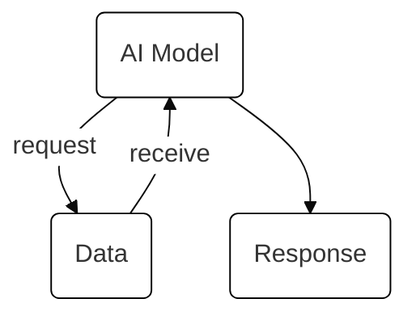

This is a [Next.js](https://nextjs.org) project bootstrapped with [`create-next-app`](https://nextjs.org/docs/app/api-reference/cli/create-next-app).

## Getting Started

First, run the development server:

```bash
npm run dev
# or
yarn dev
# or
pnpm dev
# or
bun dev
```

Open [http://localhost:3000](http://localhost:3000) with your browser to see the result.

You can start editing the page by modifying `app/page.tsx`. The page auto-updates as you edit the file.

This project uses [`next/font`](https://nextjs.org/docs/app/building-your-application/optimizing/fonts) to automatically optimize and load [Geist](https://vercel.com/font), a new font family for Vercel.

## Learn More

To learn more about Next.js, take a look at the following resources:

- [Next.js Documentation](https://nextjs.org/docs) - learn about Next.js features and API.
- [Learn Next.js](https://nextjs.org/learn) - an interactive Next.js tutorial.

You can check out [the Next.js GitHub repository](https://github.com/vercel/next.js) - your feedback and contributions are welcome!

## What's the Dictionary About?

GenAI is a liminal space. It's expanding rapidly. As a result, new terms are being added continiously.

### The Problem

Understanding these terms is not always an easy task. Definitions can be too abstract and fail to describe how these terms are actually being used.

#### Example of the Problem

What is an AI agent?

When we use the term 'agent', we typically refer to apps like customer-service chatbots or coding agent.

IBM defines it as: "a system that autonomously performs tasks by designing workflows with available tools."

The issues with this definition are:

- The word "system" is too generic. Agents usually refer to an app.

- Agents are not always autonomous; human-in-the-loop and user-feedback are popular ways of ensuring agents are safely executing tasks.

- Agents don't always design workflows. Some apps use orchestration graphs to simply have LLM models perform single, specific tasks. Even when agents design workflows, it might be a sub-flow within a larger, developer-designed workflow.

- The pharse "with available tools" is too technical relative to the rest of the definition. Someone who doesn't know what an 'agent' is will probably not understand that 'tools' refers to programming functions that provide additional context or computations.

At the end, the definition doesn't provide you with a concrete picture for what an agent is.

### A Solution

A dictionary that concretely defines AI terms, providing users with simple and accurate definitions for popular buzzwords. To do so, the dictionary will do the following:

1. Provide a 'term type' for each term. Similar to word types in traditional dictionaries, 'term type' will describe what the term refers to. Examples include: architecture, document format, protocol, and behaviour.

2. Provide 'related terms' for each term. This is also similar to conjugations/derivations in traditional dictionaries, and it helps route users to the root term. For example, some of the related terms to 'agent' are agents and agentic.

3. A concrete definition that defines terms as they're commonly used. To do so, the dictionary will provide users with different definitions depending on their background.
   - First, there will be a general defintion that should be understood by the average Joe Shmoe. Joe Shmoe is middle-aged, works as a chef, knows a few things about AI and where it's used. He uses ChatGPT from time to time, but he won't not know about specific technologies like 'agents' or apps like Notebook LM.
   - Furthermore, there should also be an 'original' definition, as in a definition that is similar to how the term is popularly defined. In the [aforementioned example](#example-of-the-problem), that would be the IBM definition. The 'original' definition should preferably be quoted, with a corresponding source. This 'original' definition will help provide users with context on how the term is commonly defined and understood. This will help ensure they're not isolated or misunderstood when engaging in conversations relating to the term.
   - There should also be a software definition that should be understood by the average Alex Dev. Alex is a middle-aged full-stack developer who makes websites for an agency. She extensively uses Cursor, and she's heard of terms like 'agents' and 'MCP'. But, she doesn't know how they work or how they fit into her development tasks.

4. The dictionary should also have multiple, short examples. That's one or two lines that help explain what the term refers to.

5. A diagram! A picture is worth a thousand words, and this dictionary is planning on using diagrams to convey the various elements associated with a term.

#### Example of the Solution

**Agent**

_Term Type_: Architecture
_Related Terms_: Agents, Agentic

##### Concrete Definition

An AI-model that uses additional, external data to generate a response.

Examples:

- 8G Mobile uses an agent in the form of a customer serivce chatbot. When a user asks about their bill, the chatbot retrieves their records to tell them how much they owe.
- Chef Gordon Townsy is selling an agent in the form of a smart menu creator. It asks for the user's favorite dishes to design a 3-course meal that matches their palletes!



##### Original Definition

"... a system that autonomously performs tasks by designing workflows with available tools." (IBM, 2024).

##### Software Data

Attaching context data and tools (programming functions) to LLM calls.

Examples:

- You can create an agent by attaching a 'GetWeather' tool to LLM calls. When a user asks about the weather, the LLM will call your 'GetWeather' tool to provide the user with the requested weather conditions.
- ChatGPT is an agent because when it's asked a techincal question, it might search the web to generate an accurate response.
